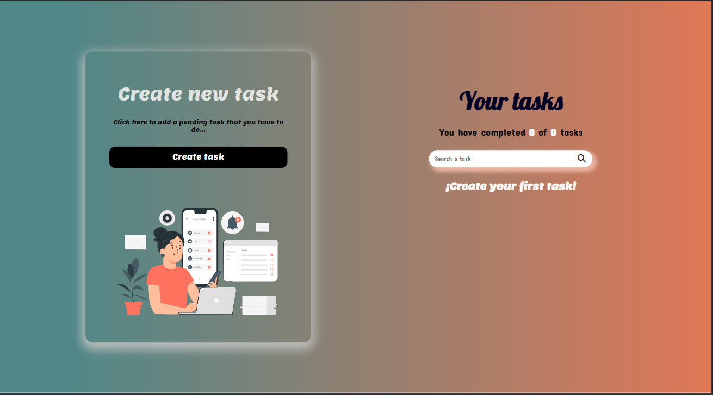
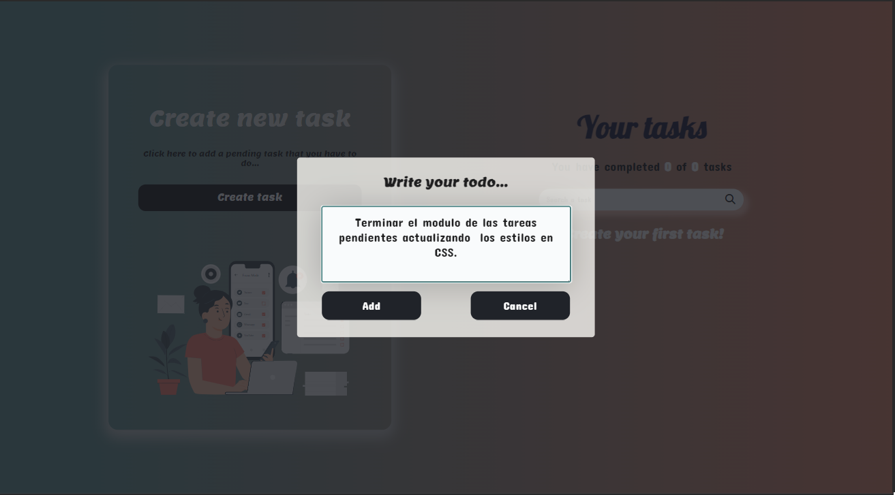
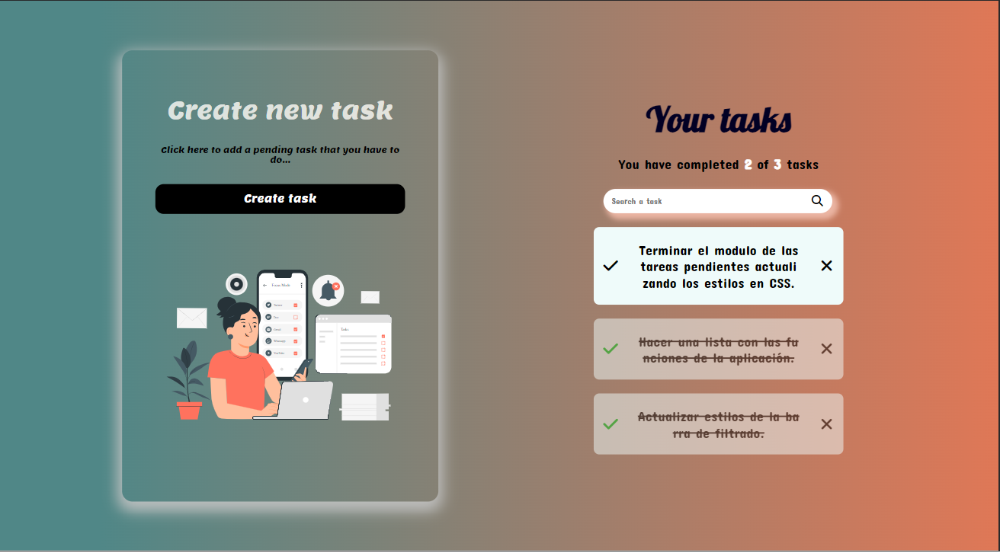
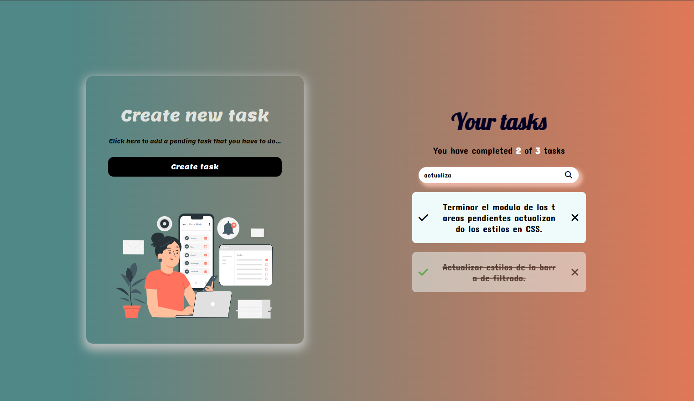

# Things To Do => https://dev-joshua.github.io/things-to-do-react/

Things To Do es una aplicación de lista de tareas desarrollada con React. Permite a los usuarios crear, marcar como completadas, eliminar y filtrar tareas. Además, las tareas se almacenan en el estado local para su persistencia.

## Características

- Crear nuevas tareas
- Marcar tareas como completadas
- Eliminar tareas
- Filtrar tareas por estado (pendiente/completada)
- Almacenamiento persistente utilizando localStorage
- Interfaz de usuario agradable con carga esquelética y animaciones

## Tecnologías Utilizadas

- React
- JSX
- CSS
- JavaScript
- Font Awesome (iconos)
- Google Fonts (tipografía)
- React Context (manejo del estado)
- Loading Skeletons (carga esquelética)
- React Portals (para la interfaz de usuario)
- Responsive Design

## Capturas de Pantalla

## Instalación

1. Clona este repositorio: `git clone https://github.com/Dev-Joshua/things-to-do-react.git`
2. Instala las dependencias: `npm install`
3. Inicia la aplicación: `npm start`

## Licencia

Este proyecto está bajo la Licencia MIT - consulta el archivo [LICENSE](./LICENSE) para más detalles.
